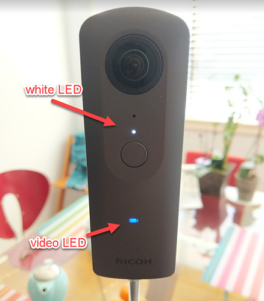
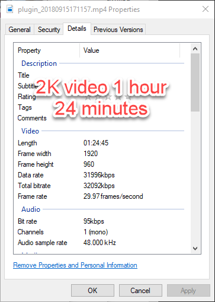

# 2K Long Video Plug-in for RICOH THETA

This sample plug-in is based on the 
[CameraAPI Capture plug-in from Ricoh](https://github.com/ricohapi/theta-plugin-camera-api-sample).  

The plug-in uses the CameraAPI to record 2K video. It bypasses the 25 minute
video limitation of the standard camera.

The plug-in should be installed into the RICOH THETA V with adb.

See this link for more information:

https://community.theta360.guide/t/theta-v-48-minute-4k-video-and-77-minute-2k-video-working/3483?u=codetricity